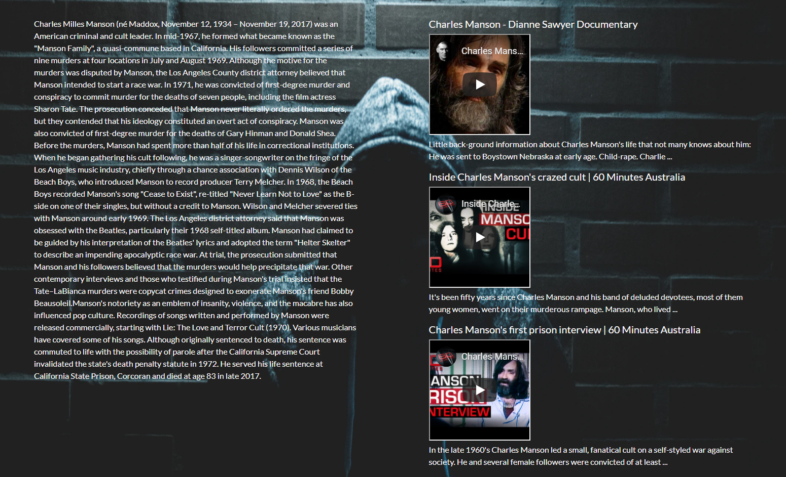

My Favorite Murderer 

A search engine to search for content about a specific murderer. This website includes a drop down menu of specific murderers to chose from. The content includes a description of the murderer and video suggestions on that murderer. This content is coming from wikipedia and youtube APIs.

Link to live app
https://aleileecorona.github.io/MurdererWebsite/

Motivation

True crime is trending right now and I wanted to create a website where you can get content in one area instead of going to multiple websites.

Screenshots:

Landing Page:

Wikipedia content:

Youtube Content!

Features:

There is a drop down menu of specific murderers to choose from. Click on a name and search.

Build With: 
jQuery
HTML
Javascript
CSS